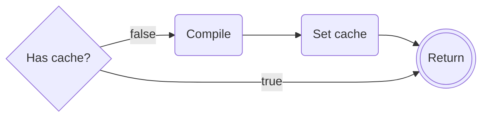

# regexpcache

Reuse compiled regexp.

## Setup

get

```
go get github.com/bddjr/regexpcache-go
```

use

```go
regexpcache.MustCompile(`\d+`)
```

## Logic


```mermaid
flowchart LR
    HasCache{Has cache?}
    Compile("Compile")
    SetCache("Set cache")
    Return(((Return)))

    HasCache -- false --> Compile --> SetCache --> Return
    HasCache -- true --> Return
```
