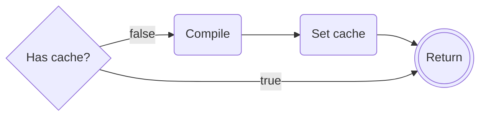

# regexpcache

Reuse compiled regexp.

## Setup

get

```
go get github.com/bddjr/regexpcache-go
```

use

```go
regexpcache.MustCompile(`\d+`)
```

## Logic



### Why not use mutex lock?

Considering concurrent scenarios, mutex locks may actually create performance bottlenecks, so mutexes are not used.  
The mutex implementation is placed in the [mutex](https://github.com/bddjr/regexpcache-go/tree/mutex) branch.
